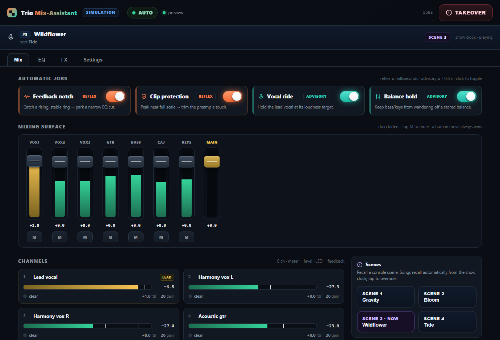
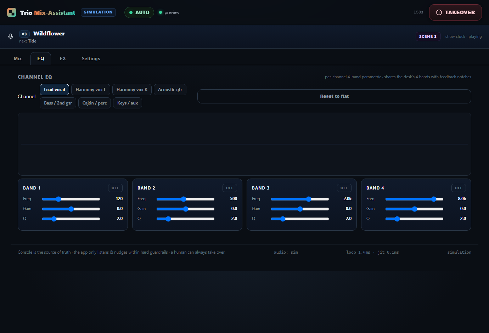
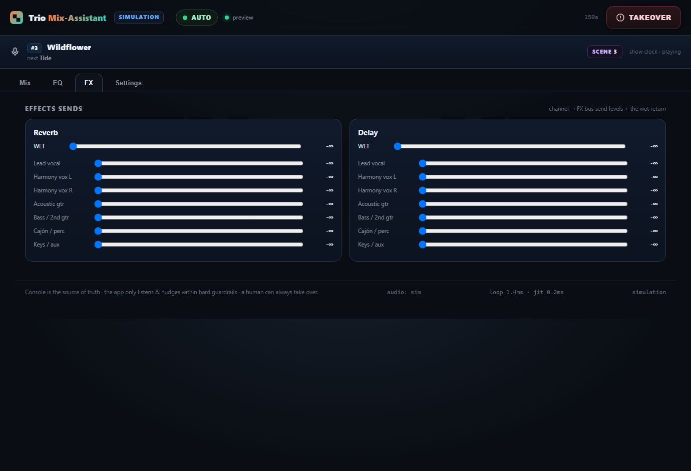
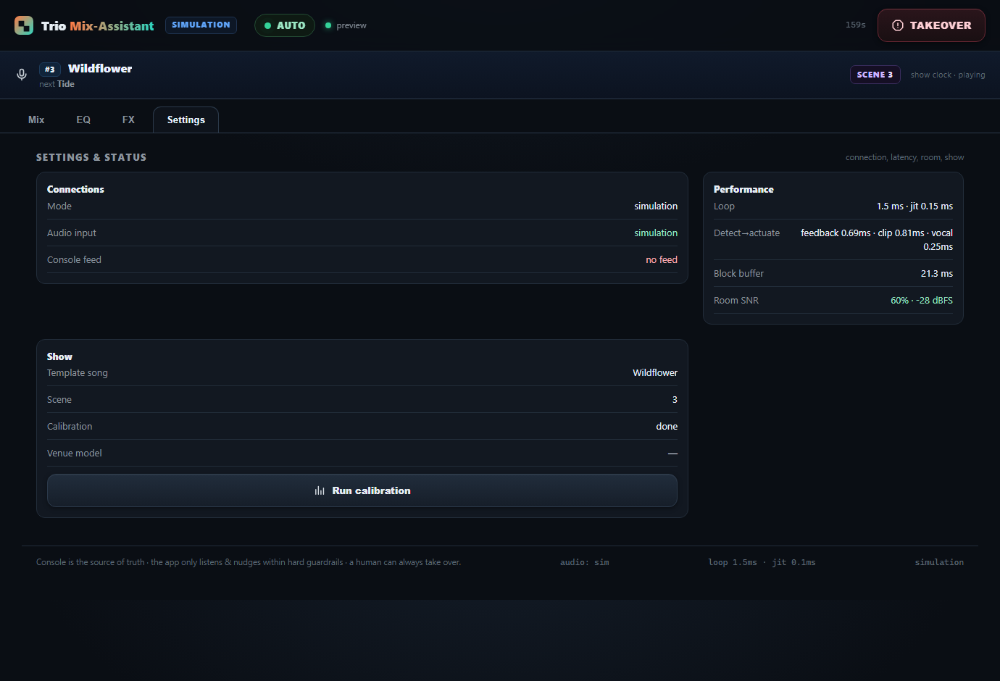
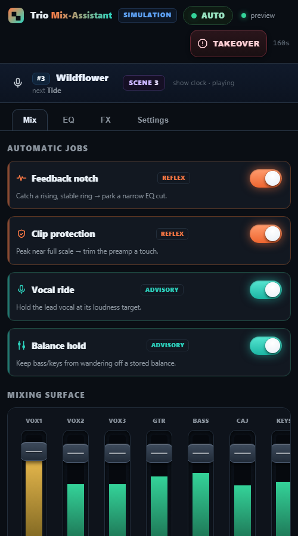
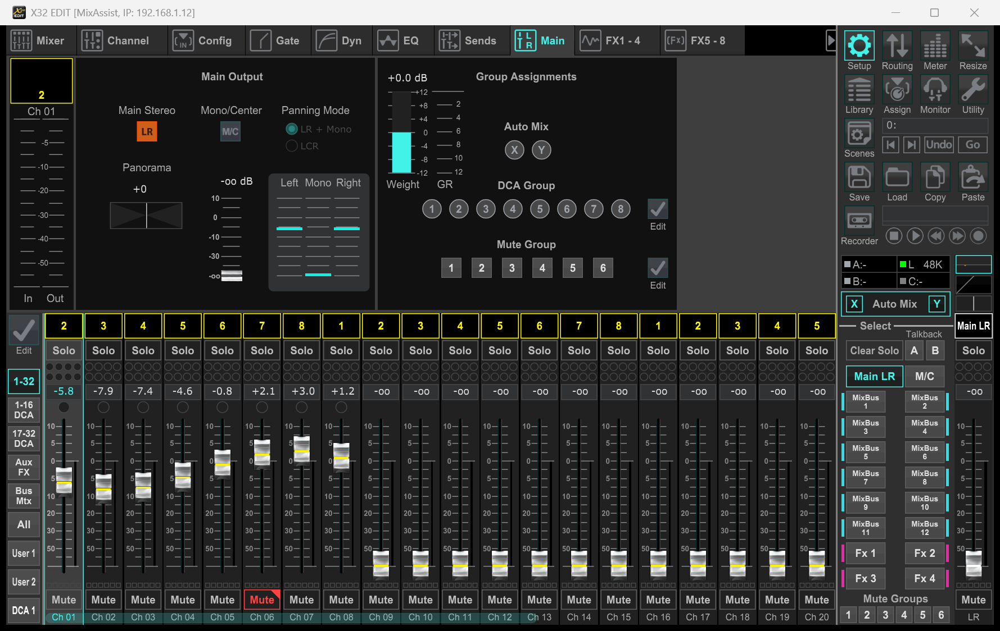

<div align="center">

# 🎚️ Trio AI Mix‑Assistant

### A live‑sound **safety net** + **operator dashboard** for a Midas M32C / Behringer X32 — for the gig with no sound engineer.

It *listens* to the band and the room, and gently *nudges* the console within hard guardrails. The console is always the source of truth, every move is logged and reversible, and **a human can take over instantly**. Runs and is fully testable **with no hardware at all**.

[Try it in 60 seconds](#-try-it-in-60-seconds) · [Requirements](#-requirements) · [Setup (PC & Mac)](#setup) · [Operating it](#operating-it) · [X32‑Edit / M32‑Edit](#x32-edit) · [How it works](#-how-it-works)



</div>

---

## ✨ What it is

Small acoustic acts often play with **no one at front‑of‑house**. This app is the missing safety net: it watches the channels and a measurement mic and makes small, safe corrections — catch a feedback ring, pull back a clipping preamp, hold the lead vocal at a steady level — while **you** keep playing.

- **Deterministic real‑time core — no AI in the audio path.** Feedback/clip/level decisions are plain DSP and clamped controllers, so behaviour is predictable. (An *optional* Claude "slow layer" can post plain‑language advice — **advisory only, it never touches the mix**.)
- **Console stays in charge.** Move a fader on the desk or a tablet and the app yields. One **TAKEOVER** button hands everything back to a human.
- **Runs with zero hardware.** A built‑in simulator and a protocol‑faithful console **emulator** let you learn, demo, and rehearse the whole rig on a laptop — and even drive **real X32‑Edit** from it (see below).
- **One dashboard, any screen.** A single installable web app (PWA) works identically on the FOH laptop, an iPad, or an Android tablet over WiFi.

## 📸 Screenshots

| Mix — jobs, faders, channels, decision log | EQ — per‑channel 4‑band PEQ |
|---|---|
| [](docs/screenshots/dashboard-full.png) |  |
| **FX — per‑channel sends + wet returns** | **Settings — status, performance, calibration** |
|  |  |

<div align="center">

**Tablet / phone (responsive PWA)** &nbsp;·&nbsp; [▶ See the full dashboard in one image](docs/screenshots/dashboard-full.png)



</div>

## 🚀 Try it in 60 seconds

No console, no mic, no audio interface — pure **simulation**. A closed‑loop "stage" drives the assistant so you can watch feedback get notched, a clip get trimmed, and the vocal ride compensate, live.

**Windows**
```powershell
git clone https://github.com/spinoza1791/trio-mix-assistant.git
cd trio-mix-assistant\app
python -m pip install numpy
python run.py
```

**macOS**
```bash
git clone https://github.com/spinoza1791/trio-mix-assistant.git
cd trio-mix-assistant/app
python3 -m pip install numpy
python3 run.py
```

Then open **http://127.0.0.1:8770/** — toggle the jobs and watch the behaviour change.

> Prefer no terminal? See **[Setup](#setup)** for the double‑click installers (`setup.bat` / `setup.command`).

## 📋 Requirements

The app has three modes; each needs different things. **Simulation needs almost nothing.**

### Software

| | 🧪 Simulation | 🎛️ Emulation (rehearse the full rig) | 🎤 Production (live show) |
|---|---|---|---|
| **Python** | 3.10+ | 3.10+ | 3.10+ |
| **Packages** | `numpy` | `numpy`, `python-osc` (+ `sounddevice` for a real mic) | `numpy python-osc sounddevice cryptography qrcode` |
| **Install** | `pip install numpy` | one‑time `setup` | one‑time `setup` (bundles all of the above) |

### Hardware

| | 🧪 Simulation | 🎛️ Emulation | 🎤 Production |
|---|---|---|---|
| **Computer** | Any PC / Mac | Any PC / Mac | FOH laptop (Win/macOS) |
| **Console** | — | — (emulated) | **Midas M32C** or X32‑family, on the LAN |
| **Audio interface** | — | Optional (USB mic to test calibration/feedback) | Console USB/card feed **or** an interface (e.g. Focusrite Scarlett) |
| **Measurement mic** | — | Optional | **Yes** — a mic at FOH for room + feedback listening |
| **Network** | — | — | WiFi router/switch linking laptop ↔ console (↔ tablet) |
| **Tablet** | — | Optional | Optional — iPad / Android for a wireless dashboard |
| **AbleSet** | — | — | Optional — automatic scene recall from the setlist |

> 💡 **Don't have the console yet?** Use **Emulation** — it runs the *exact* production code against a built‑in M32C emulator over real network sockets. You can plug in a USB mic and run a real pink‑noise room calibration and feedback test. See [Operating it](#operating-it).

<a id="setup"></a>

## 🛠️ Setup

> Copy the `app/` folder to the FOH laptop (or run it from the clone). The one‑time setup builds a local Python environment so nothing else on the machine is touched.

### Windows
1. Install **Python 3.10+** from [python.org](https://www.python.org/downloads/) — tick **“Add Python to PATH”**.
2. In `app/`, double‑click **`setup.bat`** (one time).
3. Double‑click **`list-devices.bat`** and note your audio device number.
4. Open **`show.conf`** in Notepad → set `CONSOLE_IP` and `AUDIO_DEVICE` (or set `AUTO=yes` to auto‑detect).
5. Double‑click **`start.bat`** — the dashboard opens in your browser.

### macOS
1. Install **Python 3.10+** from [python.org](https://www.python.org/downloads/).
2. Open Terminal, `cd` into `app/`, then `bash setup.command` (one time).
3. `bash list-devices.command` and note your audio device number.
4. `open show.conf` → set `CONSOLE_IP` and `AUDIO_DEVICE` (or `AUTO=yes`), save.
5. `bash start.command`.
   - The first run, macOS asks for **Microphone** and **Network** permission — **allow both** (System Settings → Privacy & Security → Microphone), or capture stays silent.

> 🧪 **No hardware?** Double‑click **`rehearse.bat`** (Windows) / `bash rehearse.command` (macOS) to run the whole app against the built‑in emulator.
> 📡 **Offline install:** on a same‑OS machine with internet, run `fetch-wheels` to fill a `wheels/` folder, copy the folder over, then `setup` installs with no internet.

<a id="operating-it"></a>

## 🎚️ Operating it

All commands run from the **`app/`** folder. The double‑click scripts above wrap these; the CLI gives full control.

### Run modes

| Mode | Command | What it does |
|---|---|---|
| **Simulation** | `python run.py` | Closed‑loop synthetic stage. Learn the UI, demo, no gear. |
| **Emulate (no console)** | `python run.py --emulate --lan` | Real production stack vs. a built‑in M32C emulator. |
| **Emulate + real mic** | `python run.py --emulate --lan --auto` | Same, but listens on your **real USB mic** — run a true room calibration & feedback test. |
| **Production** | `python run.py --hardware --console-ip 192.168.1.50 --auto --lan` | Drive the real M32C. `--auto` detects the mic; or use `--audio-device N`. |

Helpful flags: `--list-devices` (find audio inputs), `--lan` (serve to tablets + print a QR), `--https` (TLS, enables the tablet PWA + screen wake‑lock), `--template set.json` (per‑song scenes), `--venue "The Cellar"` (session log + learning), `--advisor` (optional Claude notes; needs `ANTHROPIC_API_KEY`).

### On the dashboard
- **AUTOMATIC JOBS** — toggle Feedback notch, Clip protection, Vocal ride, Balance hold.
- **MIXING SURFACE** — drag faders, tap **M** to mute; a human move makes auto‑ride yield on that channel.
- **Pink‑noise calibration** (Settings → *Run calibration*) — measures the room, parks gentle cuts on the worst peaks, and builds a feedback watch‑list. The result shows as an octave‑band chart with ▲ watch / ▼ cut chips.
- **Scenes** — recall console scenes; with a show template they recall automatically per song.
- **TAKEOVER** — mutes the main and holds all jobs so a human always wins.
- **Deep links** — `…:8770/#eq`, `#fx`, `#settings` open straight to a tab (handy on a tablet).

### On a tablet (iPad / Android)
Run with `--lan --https`, then on the tablet (same WiFi) scan the printed **QR code**, accept the certificate warning once, and **Add to Home Screen** for a full‑screen app. On Windows, click **Allow** on the first‑run Firewall prompt (Private network).

<a id="x32-edit"></a>

## 🎛️ X32‑Edit / M32‑Edit

The **M32C has no faders or screen of its own** — it's a stage box, controlled entirely from a computer/tablet. **X32‑Edit** (Behringer) and **M32‑Edit** (Midas) are the free official editor apps for the X32/M32 family; you'll want one installed for full console control alongside this assistant.

### Download (official, free — Windows / macOS / Linux)

| Editor | Use it for | Download |
|---|---|---|
| **X32‑Edit** (v4.4) | X32 family; works with M32 too | [behringer.com → X32 → Product Library → Software](https://www.behringer.com/en/products/0603-ACE) · [Mac App Store](https://apps.apple.com/lt/app/x32-edit/id6754563545) |
| **M32‑Edit** | Midas **M32 / M32C** (native) | [midasconsoles.com → M32 → Downloads](https://www.midasconsoles.com/en/products/0603-aeo) |

> Pick the build for your OS (Windows / macOS / Linux / Raspberry Pi). These editors talk to the console over the network on UDP **10023**.

### 🔌 Bonus: drive **real X32‑Edit from the emulator** — no console needed

This project's emulator answers X32‑Edit's discovery handshake, so you can **connect the real editor to your laptop** and watch the assistant drive a genuine console GUI:

1. `python run.py --emulate --lan` — it prints `X32-Edit: connect it to <your-ip>:10023`.
2. In X32‑Edit, connect to that IP (or `127.0.0.1` on the same PC). It discovers **“MixAssist”** and transfers channels.
3. Watch the assistant's moves mirror live on the editor. To push test moves yourself: `python osc_demo.py --animate`.

This also lets you **validate the OSC** against Behringer's own software with no gear — set a fader to a known dB and confirm the editor shows the same value. (The fader law is already verified this way.)

**Real X32‑Edit mirroring the app live** — connected to *MixAssist* (IP 192.168.1.12) over the emulator. The channel faders and the muted **Ch 06** are exactly what the assistant pushed:



## 🧠 How it works

```
 mic + channels ─▶ DSP features ─▶ 4 guard‑railed jobs ─▶ clamp ─▶ Console (OSC)
   (listen)         (analyse)        (decide)            (safe)     (nudge)
                                          │
                          telemetry ──────┘──▶ dashboard (WebSocket / SSE)
```

| Job | Tier | Behaviour |
|---|---|---|
| **Feedback notch** | reflex | Catch a *rising*, *frequency‑stable* ring (sung notes are rejected) → park a narrow EQ cut. Calibration watch‑list freqs react a beat sooner. |
| **Clip protection** | reflex | Peak within ~1 dB of full scale → trim the preamp; creep it back once clean. |
| **Vocal ride** | advisory | Hold the lead vocal's *output* at a target as the singer's input drifts (deadband + step‑limit + smooth ramp). |
| **Balance hold** | advisory | Snapshot the bass/keys balance and hold it from wandering. |
| **Pink‑noise calibration** | pre‑show | Measure the room, cut the worst peaks, pre‑dip feedback‑prone freqs, seed the watch‑list. |

Everything passes hard **guardrails** (fader/gain range, max step, smooth ramp); every move is **logged and reversible**. **221 automated tests** cover the OSC scaling, detection logic, the decision loops, the HTTP/WebSocket server, the hardware capture path, and a real‑socket round‑trip against the emulator.

## 📂 Project layout

```
trio-mix-assistant/
├── README.md                 ← you are here (overview + setup)
├── app/                      ← the application
│   ├── run.py                ← entry point (sim / emulate / hardware)
│   ├── osc_demo.py           ← push moves so X32-Edit mirrors the app
│   ├── trio_mix/             ← package: dsp, osc, assistant, engine, server…
│   ├── static/index.html     ← the single-file dashboard (no build step)
│   ├── tests/                ← 221 unit + integration tests
│   ├── setup/start/list-devices/rehearse  (.bat + .command)
│   ├── README.md             ← developer docs (architecture, internals)
│   ├── RUNBOOK.md            ← show-day guide (Windows & macOS)
│   └── HARDWARE_BRINGUP.md   ← one-time OSC validation against the real desk
└── docs/
    ├── screenshots/          ← the images above
    └── mix-assistant-design.html  ← design infographic
```

**Go deeper:** [app/README.md](app/README.md) (architecture & internals) · [app/RUNBOOK.md](app/RUNBOOK.md) (show‑day) · [app/HARDWARE_BRINGUP.md](app/HARDWARE_BRINGUP.md) (real‑desk validation).

## ✅ Tests

```bash
cd app
python -m unittest discover -s tests
```

## 📄 License & disclaimer

[MIT](LICENSE) © 2026 spinoza1791.

Not affiliated with or endorsed by Music Tribe, Behringer, or Midas. *X32‑Edit*, *M32‑Edit*, *X32*, and *M32* are trademarks of their respective owners — download their software only from the official links above. **OSC scalings vary across firmware; validate against your console before trusting it live** (see [HARDWARE_BRINGUP.md](app/HARDWARE_BRINGUP.md)).
