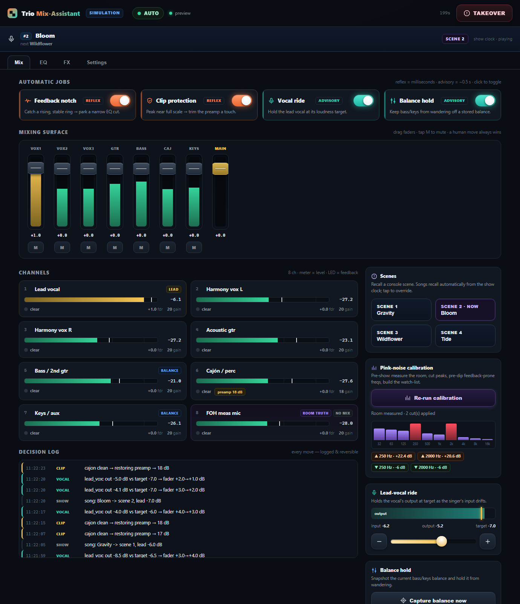

# Acoustic Trio AI Mix-Assistant

A deliberately small **safety-net** for a small acoustic-trio gig with no sound
engineer. It *listens* to the channels + a FOH measurement mic and *nudges* a
Midas M32C (X32/M32 OSC family) within hard guardrails — and ships with a live
**operator dashboard** and a **closed-loop simulator** so the whole thing runs
and is testable without any hardware.

The **real-time control path is deterministic** — no ML, no LLM: calibration-
derived priors, a multi-guard feedback detector, and clamped output-levelers.
The only AI is an **optional, latency-tolerant Claude "slow layer"** that can
suggest plain-language notes for the band/operator — it is *advisory only* and
**never touches the mix**. That fast/slow split is the core safety boundary.

Beyond the safety net it implements the AutoFOH show-side features:
- **AbleSet show clock → automatic scene recall** with per-song reference levels;
- a **performer dashboard** with screens — Mix, **EQ** (per-channel 4-band PEQ with
  a live curve), **FX** (per-channel sends + wet returns), **Settings** (status) —
  an AUTO/ALERT/MANUAL headline, and a **4-level notification hierarchy** (silent →
  log → banner → full-screen acknowledged overlay) with an **8-bar opening gate**;
- **template-driven channel maps** (the 8-ch trio *or* a 13-input rig from one JSON),
  guest mode, and stereo links;
- **venue learning** — post-show analysis writes a per-venue model (recurring
  feedback freqs + confidence) that pre-seeds the watch-list next time;
- **detect→actuate latency** + **room-mic SNR confidence** instrumentation.

See the repo **[README](../README.md)** (overview, screenshots, setup), the
**[design infographic](../docs/mix-assistant-design.html)**, **`HARDWARE_SETUP.md`**
(optimal listening rig + system requirements — what to buy & how to wire it),
**`RUNBOOK.md`** (show-day guide, Windows & macOS) and **`HARDWARE_BRINGUP.md`**
(one-time OSC-validation checklist).



## Quick start

```bash
pip install numpy            # python-osc only needed for real hardware
python run.py                # simulation mode (no hardware)
# open http://127.0.0.1:8770/
```

In simulation a closed-loop "stage" drives the assistant: a feedback ring grows
until it's notched, a cajón transient overloads until the preamp is trimmed
(then recovers), and the lead vocal's input drifts so the ride visibly
compensates. Toggle the jobs and watch the behaviour change.

### Real hardware

```bash
pip install numpy python-osc sounddevice          # sounddevice = the listening half
python run.py --hardware --console-ip 192.168.1.50 --list-devices   # find your interface
python run.py --hardware --console-ip 192.168.1.50 --audio-device 2 --lan
```

The **listening half** is wired: `--audio-device` opens a multichannel PortAudio
(ASIO/WASAPI) stream — the console's USB/card feed + the FOH measurement mic —
and drives the assistant (feedback FFT, clip, vocal ride) and the pink-noise
calibration for real. Omit `--audio-device` to run hardware mode with **manual
control + scene recall only** (the assistant stays inactive, clearly logged).

**Console → app reconciliation (shared control) is wired too:** the app
subscribes to `/meters` + `/xremote`, so when a human moves a fader on the desk
or iPad, the console pushes the change, the app adopts it, and auto-ride yields.
Audio dropouts, a lost console feed, and a silent calibration are all detected
and surfaced.

> ⚠️ OSC scalings vary slightly across Behringer/Midas firmware. Verify every
> constant against your console with a sniffer (Wireshark / X32 OSC monitor)
> before trusting it live — the reference spec flags this repeatedly. The full
> bench/soundcheck procedure is in **`HARDWARE_BRINGUP.md`**.

### Emulated hardware (full stack, no gear)

```bash
pip install python-osc
python run.py --emulate          # real OSC over localhost vs. a desk emulator
```

`--emulate` runs the **production** path — the real `OscConsole` sends OSC over a
UDP socket to an in-process **protocol-faithful M32C emulator** that streams
`/meters`, echoes `/xremote` fader pushes, and answers scene recalls; a timed audio
stream feeds the real capture queue so the assistant catches feedback over the live
loop. It exercises framing, the subscribe/renew handshake, reconciliation timing,
and the capture/dead-stream paths with no hardware. `tests/test_contract.py` pins
the exact wire layout. **Caveat:** the emulator encodes the same protocol
*assumptions* the app does, so it proves mechanical correctness, not that the
formats match your firmware — that last step is `HARDWARE_BRINGUP.md`.

### Show clock, AI advisor & session log

```bash
# automatic scene recall from AbleSet (per-song scenes + reference levels)
python run.py --hardware --console-ip <ip> --template myset.json --ableset-port 39051

# optional Claude advisory layer (advisory notes only — never controls the mix)
export ANTHROPIC_API_KEY=sk-...    # PowerShell: $env:ANTHROPIC_API_KEY="sk-..."
python run.py --advisor --venue "The Cellar"
```

- **Show template** (`--template file.json`): a validated setlist mapping each song
  (as AbleSet names it) to a console `scene` plus per-song `lead_target` / `balance`
  reference levels and an optional `guest` flag. Omit it for the built-in trio set.
  In simulation the clock walks the setlist automatically so you can watch scenes
  recall live; `--no-show-clock` disables that.
- **AI advisor** (`--advisor`): a background Claude (Haiku) worker that periodically
  reads recent events and posts a short note ("guitar is masking the vocal — ease
  off"). It runs entirely off the real-time path and is **advisory only**. With no
  `ANTHROPIC_API_KEY` it's simply disabled — everything else still works.
- **Session log**: every decision is written to SQLite (`sessions.db`, off the
  real-time path) tagged with `--venue`, for post-show analysis and venue learning.
  `--session-db off` disables it.

### Larger bands & extensions

The trio (8-channel) map is the default; the config is the single place to grow it.
In `trio_mix/config.py`: extend `CHANNELS`/`ROLE_LABELS`, then set `GUEST_CHANNELS`
(unmuted on `guest` songs), `STEREO_LINKS` (e.g. `((2, 3),)` so harmony L/R move
together), and `STAGE_MIC_CH` (a second ambient mic that flags a sustained rise in
stage loudness). All default to empty/None, so the trio is unaffected.

## Run on a tablet (iPad / Galaxy Tab S7) — one web app, both

The dashboard is an installable **PWA**, so the same code runs identically in
Safari (iPad) and Chrome (Android) — no native app, no App Store. The engine
runs on the FOH laptop; the tablet is a thin client over the LAN.

```bash
python run.py --lan            # bind to the LAN; prints the tablet URL + QR code
python run.py --lan --https    # + TLS, so Wake Lock & PWA install work
# on the tablet (same WiFi): scan the printed QR (or open the URL) -> Add to Home Screen
```

The launcher prints the desktop's LAN URL **and a scan-to-open QR code** — point
the Tab S7 / iPad camera at it. Both devices must be on the **same WiFi**, and on
Windows the first run pops a **Firewall** prompt — click *Allow* on Private
networks (the desktop must be on a *Private*, not *Public*, network).

"Add to Home Screen" launches it full-screen (landscape, no browser chrome).
**`--https`** generates a self-signed cert (LAN IP baked into the SAN) so the
tablet gets a *secure context* — required for **Screen Wake Lock** (screen stays
on during a show) and a real PWA install; accept the cert warning once on the
tablet. Over plain `http`, Wake Lock no-ops, so instead set the tablet's
auto-lock to *Never* (on iPad, Guided Access also works). Touch targets,
safe-area insets, and double-tap zoom are all handled; the mixing surface runs
over `wss://` automatically under https.

## What it does

| Job | Tier | Behaviour |
|-----|------|-----------|
| **Feedback notch** | reflex | Catch a *rising* and *frequency-stable* ring (guards reject sung notes), park a narrow PEQ cut. Calibration watch-list freqs react one block sooner. |
| **Clip protection** | reflex | Peak within 1 dB of full scale → trim the preamp; creep it back once clean. |
| **Vocal ride** | advisory | Hold the lead vocal's *output* at a target as the singer's input drifts (clamped P-leveler: deadband + step limit + smooth ramp). |
| **Balance hold** | advisory | Snapshot the bass/keys balance and hold it from wandering. |
| **Pink-noise calibration** | pre-show | Measure the room, cut the worst peaks, pre-dip feedback-prone freqs, build the baseline + watch-list. |
| **Manual mixing surface** | performer | Draggable per-channel fader strips + master + one-tap mute, over WebSocket. A human move makes the auto-ride **yield** on that channel for a few seconds (shared-control). |
| **Coach mode** | advisory | A header toggle that suspends **every** automatic console write — mix corrections *and* setlist automation (scene recall, guest mutes) — and instead lists the exact manual move (channel, band, dB, Hz, scene) in a panel + the log. Only your own manual moves act. **No LLM/AI** — the numbers are the same deterministic math. For mixing by hand with guidance, or previewing what the app would do. |

Everything passes through **guardrails** (hard fader/gain range, max step,
smooth ramp), every move is **logged and reversible**, and a **TAKEOVER**
button mutes the main and holds all jobs so a human always wins.

## Architecture

```
SimCapture / SoundDevice ─▶ dsp.analyse_block ─▶ MixAssistant ─▶ guardrails ─▶ Console(OSC)
      (audio in)               (features)          (4 jobs)        (clamp)       (control out)
                                                       │
              engine telemetry ◀───────────────────────┘
                      │  (WebSocket / SSE)
                  server.py ──▶ static/index.html  (the dashboard)
```

| Module | Responsibility |
|--------|----------------|
| `config.py` | Rig map + all tunable constants |
| `dsp.py` | Features, ring detection, pink-noise + octave-band math (pure) |
| `osc.py` | X32/M32 scaling + `ConsoleBase` → `OscConsole` (UDP) / `SimConsole` (records) |
| `calibration.py` | Pre-show pink-noise pass |
| `assistant.py` | The four guard-railed decision loops + typed decision log |
| `engine.py` | Closed-loop simulator + live telemetry + runtime threads |
| `server.py` | stdlib HTTP + Server-Sent Events + control endpoints |
| `static/index.html` | The operator dashboard (single file, no build step) |

Transport is a **WebSocket** (`/ws`) for the bidirectional mixing surface —
telemetry out, fader/mute/control in — implemented on the stdlib (no FastAPI),
with **SSE + POST** as automatic fallback. Same-origin, zero web framework.
(This realigns the transport with the AutoFOH pilot's WebSocket spec and
implements its Phase-4 performer surface — fader strip + EQ/FX/Settings screens.)

## Tests

```bash
python -m unittest discover -s tests
```

221 tests covering OSC scaling round-trips + guardrail clamps, DSP/detection,
the four decision loops (incl. that a steady sung note is *not* notched and a
rising ring *is*), calibration, the HTTP/SSE/WebSocket endpoints, the
**hardware** path (capture buffering/mapping/meas with an injected stream, meter
blob decode, console-fader reconciliation, dead-stream silence + recovery, silent-
mic detection, calibration-on-silence, and an injected source driving the
assistant), the **show side** (template validation, sim + AbleSet show clocks,
auto scene recall, AUTO/ALERT/MANUAL mode, notification levels, 8-bar gate, manual
scene recall), the **performer surface** (EQ/FX/send commands + clamping, the
**template-driven 13-ch map**, detect→actuate latency, room-mic SNR confidence),
the **AI/logging layer** (SQLite session log off the real-time path, the advisory
loop with an injected caller, advisory-only safety, **venue learning** model
build/save/load + watch-list seeding), the **extensions** (guest mode, stereo
links, stage-mic detection), a **contract** suite that pins the X32/M32 wire
layout + a full real-socket round-trip against the desk emulator, and a
**robustness** suite: a multi-thread concurrency stress test, malformed/NaN/
deeply-nested input rejection, the calibration-vs-takeover guard, the main-bus
band allocator, scaling-domain safety, and WebSocket fragmentation / masking /
body-size limits.

### Robustness & threading

- **One reentrant lock owns all state** — engine, assistant, console mirror,
  event log, telemetry. The loop thread and every HTTP/WebSocket handler thread
  go through it, so there are no races (no torn reads, no
  deque-mutated-during-iteration, no dict-changed-size-during-build).
- **The loop self-heals** — a bad block is caught, logged (throttled), and the
  engine keeps running instead of dying silently.
- **Nothing slow runs under the lock** — fader ramps run on a background worker,
  and calibration's heavy FFT analysis runs off-lock (only the fast OSC apply is
  locked), so client feeds never freeze.
- **Untrusted input can't crash or wedge the server** (it binds to the LAN):
  bodies are size-capped, JSON `NaN/Infinity` and deeply-nested (`RecursionError`)
  payloads are rejected (and the connection closed so keep-alive can't desync),
  the WebSocket parser caps frame size, requires client masking, and handles
  fragmentation, and a connection-count semaphore + socket timeouts bound
  thread/stall DoS. Malformed control messages are ignored, never fatal.
- **Shared-resource coordination** — calibration resets the whole main-bus EQ
  before applying, and a band allocator keeps live feedback notches off the bands
  calibration claimed (so they never clobber each other and `reset` only clears
  feedback bands); calibration refuses to run during a takeover and pauses the
  assistant during its sweep; the OSC socket and ramp worker close cleanly.
- **Clean rejection** — an over-cap request body is *drained* before the 400 so
  closing can't RST and lose the response.
- **Front-end resilience** — one transport at a time (WebSocket primary, SSE
  fallback) with a single bounded reconnect (no double-connect, no storm);
  `render()` tolerates missing/NaN fields; the wake lock isn't re-leaked; faders
  can't get stuck mid-drag; all server-derived values are escaped.

## Notes / honest deltas from the reference skeleton

- **Vocal ride is an output-leveler.** The reference compared the input tap to
  the target and would ramp to the rail; here the controller holds
  `input + fader` at the target, which actually converges.
- **Clip recovery** (creep the preamp back when clean) and **balance hold** are
  implemented here; they were specified but stubbed in the reference.
- **The listening half is wired** (`capture.py`): a pluggable `CaptureSource` —
  `SimCapture` (simulation) or `SoundDeviceCapture` (real PortAudio multichannel) —
  feeds the assistant and the pink-noise calibration. The generic capture path was
  smoke-tested against a real input device; the **console-specific routing/channel
  map is not yet hardware-validated** (see `HARDWARE_BRINGUP.md`).
- **State reconciliation is wired** (`metersrv.py`): the app subscribes to
  `/meters` + `/xremote`, decodes the meter blob, and adopts a human's console
  fader move (auto-ride yields), suppressing the echo of its own moves. The one
  firmware-specific detail to verify with a sniffer is the exact `/meters` blob
  layout and OSC scalings (the spec flags this).
